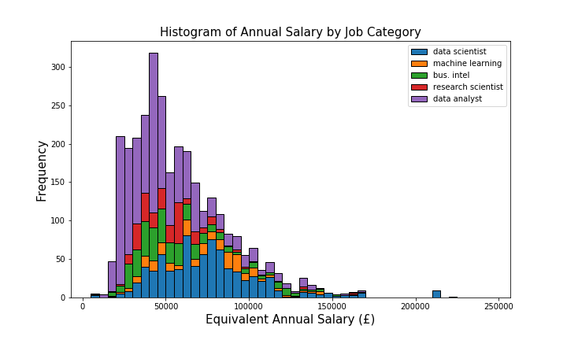
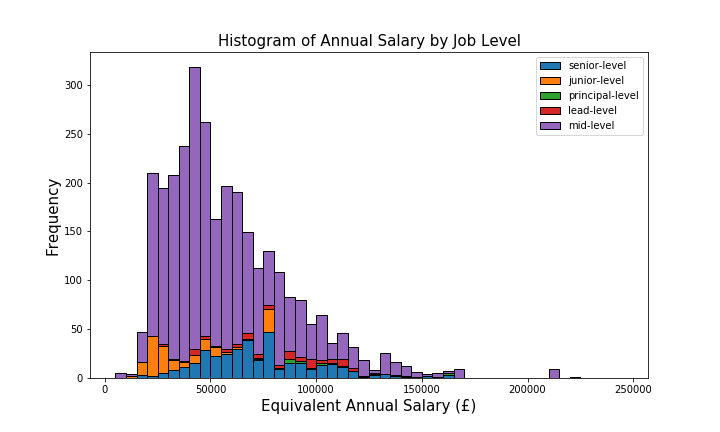
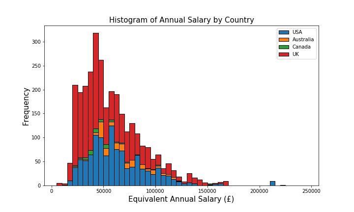
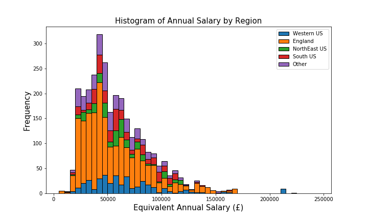
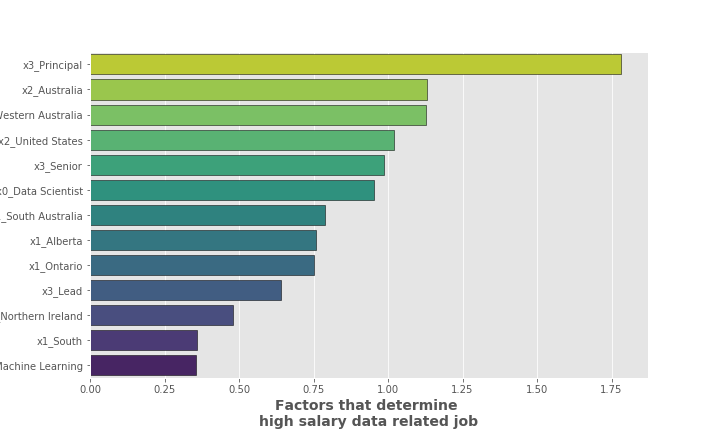
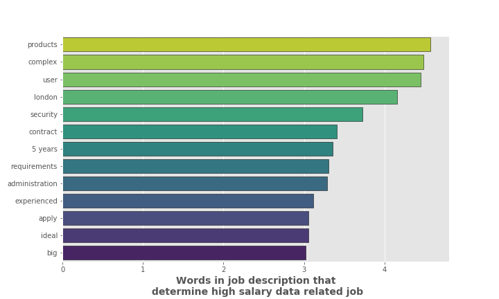
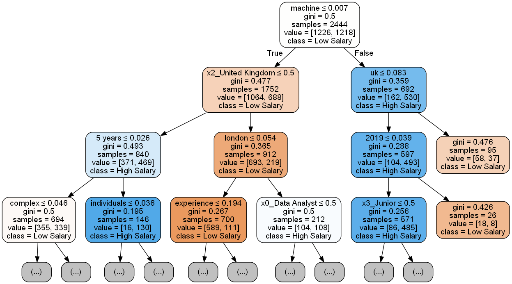
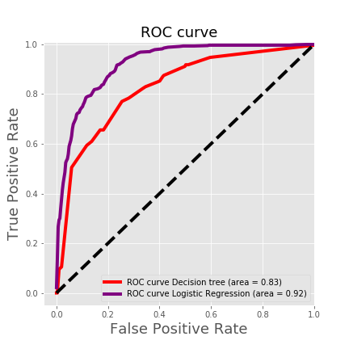
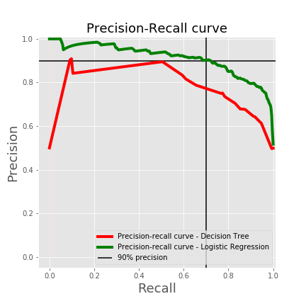

# Predicting High Salaries for Data-related Jobs in the US, UK, Canada & Australia

## Business Case Overview

The following model could be used for the following reasons:

1. For a firm looking to offer technology and scientific solutions for any business (B2B) looking to to be competitive in the hiring market for data-related jobs.
2. For a firm looking to understand the data industry factors that are most important in predicting the various salary amounts.

#### Definitions

> **Data-related job postings** - data scientist, data analyst, research scientist, business intelligence

---

#### Background

DataRecruit Intl., British recruiters for ``elite Data Professionals in industry`` has approached **GA technology solutions** to build a model to predict accurately whether jobs posted online are high or low relative to the median global salary for Data related jobs. They have made a baseline requirement that what ever **the model predicts should be 90% precise when determining high salary jobs** as this is what is important to their clients and their own reputation.

____

#### Approach
**GA technology solutions** has taken the approach to web scrape known Data Science job postings with salary information from 4 major countries where Data Scientists operate from Indeed.com. Over 3,000 jobs were identified and care was taken to convert the salary information for the respective currency exchange rates to the firms local currency (£). The raw data captured was:
1. Annualized equivalent salary - **Target Variable**
- Job Category (e.g Data Scientist, Data Analyst, Machine Learning Engineer)
- Job Level (e.g Senior, Junior, Principal)
- Job Region (e.g NorthEast USA, South Australia, Alberta)
- Country where the job was posted (e.g USA, UK, Canada, Australia)
- The full job description and summary

____

#### Exploratory Data Analysis

The exploratory data analysis indicate that job levels (Senior and Mid) and job category (Data Scientist and Data Analyst) maybe good features for segregating high salary jobs from low because of the differences in the median of their histograms below:

<table><tr><td><figcaption><b>Figure 1a</b></figcaption></td><td><figcaption><b>Figure 1b</b></figcaption></td></tr></table> 
<table><tr><td><figcaption><b>Figure 1c</b></figcaption></td><td><figcaption><b>Figure 1d</b></figcaption></td></tr></table> 

##### Target Variable
The target or dependent variable was then converted to 1's and 0's with 1 representing a high salary job (> £50,000) and 0 representing a low salary job (< £50,000). £50,000 was determined to be the median data related salary for the jobs surveyed.

##### Predictor Variables
Each independent variable or predictor listed above was converted from a categorical variable (having labels) to a numeric vector of 1's and 0's (binarized) to indicate the presence of the label in a job positing. This was also done using every word in the full job description by the process of Term Frequency Inverse Document Frequency (Tfidf) which determined the relative density of particular words within all job postings. The most frequent 500 words which showed up more often than 0.2% of the time and less often than 90% of the time were used for the model input. 

This combined matrix of numeric vectors representing words and variables was then used as the input to two models that were selected, 1) A logistic regression model and 2) A decision tree model

The 3000+ job postings information was then split into two parts: 1) 80% of the data was split to train or fit the models 2) the remaining 20% was used to test the model on unseen data.

____

#### Model Optimization
Using the a trial and error procedure in the form of a process called GridSearch, we attempted to tune both models hyperparameters to improve their accuracy. These hyperparameters were adjusted to ultimately search for the combination of components that would deliver the highest cross validated accuracy on the training data.

The tuned logistic regression model improved its accuracy to 84.1% and the decision tree  model improved its accuracy to 75%. This indicated that not much optimization/regularization was needed from initial model hyperparameters.

When testing both models on unseen data (test data) out of 612 job postings: 
- The logistic regression model classified 516 job postings correctly as high/low salary jobs 
- The decision tree model classified only 469 job postings correctly as high/low salary jobs

##### Factors which determined high salary jobs

From the logistic regression model the following factors were seen to increase the odds that a job posting is classified as having a high salary:

1. Job postings that explicitly place job level criteria such as ``Principal``, ``Senior`` and ``Lead`` in its title.
- Job postings from the ``United States`` or ``Australia``.
- Job postings that fall into the job category of ``Data Scientist``or ``Machine Learning``
- Job postings from the region ``South Australia``, ``Saskatchewan``, ``Ontario``, ``Queensland``, ``Western USA`` or ``NorthEast USA``
- Job postings which have words like ``london``,``complex``,``contract``,``5 years`` or ``experienced``

<table><tr><td><figcaption><b>Figure 2a</b></figcaption></td><td><figcaption><b>Figure 2b</b></figcaption></td></tr></table> 

From the Decision tree model the following were important features of the job ad for determining high salary jobs:

A job ad that....
1. **EITHER** mentioned the word ``5 years`` often in its job description but the posting didn't originate from the ``United Kingdom`` and didn't mention the word ``machine`` much in its job description. 

2. **OR** mentioned the word ``machine`` often in its job description but didn't mentioned the words ``uk`` and ``life`` much.

3. **OR** mentioned the word ``machine`` and ``uk`` often in its job description but didn't mentioned the word ``required`` much.

> - The word ``machine`` in a job description contributed **~20%** to the separation of high salary jobs from low salary jobs
> - Job postings originating from the ``United Kingdom`` contributes **~12.2%** to the separation of high salary jobs from low salary jobs
> - The word ``5 years`` in its job description contributed **~6%** to the separation of high salary jobs from low salary jobs

<table><tr><td><figcaption><b>Figure 3</b></figcaption></td></tr></table> 

____

#### Model Evaluation

The models precision scores for predicting high salary jobs were 82% and 75% precision for the Logistic Regression model Decision Tree Model respectively. **This fell below the 90% precision requirement specified by the client.**

To address this the **probability threshold for identifying a high salary job was adjusted**. The current setting for the levels of precision seen was 0.5 (meaning any probability determined for a given observation for the high salary class that was greater than 0.5 would be classified as high salary). 

**This default threshold was adjusted to 0.75** (meaning any probability determined for a given observation for the high salary class that was greater than 0.75 would be classified as high salary - anything below this would be designated as low salary)

Looking at the Receiver Operating Curve (ROC) and the Precision Recall Curve for both models in Figure 4, the Logistic Regression model out performs the Decision tree model with respect to having the highest combined precision and recall.

The 90% precision requirement translates to minimizing the False Positive rate to no more than 0.1 (10 wrongly predicted high salary jobs in every 100 truly low salary jobs) and boosting the true positive rate or recall.

<table><tr><td><figcaption><b>Figure 4a</b></figcaption></td><td><figcaption><b>Figure 4b</b></figcaption></td></tr></table> 

____

#### Risks and Limitations

There were several risks and limitations of the approach taken which are listed below:

##### The Data
**1. Salaries were not adjusted for purchase power parity (PPP)** 
While the salaries were adjusted for exchange rate differences they were not adjusted for purchase power parity (PPP) which would truly give a measure of effective comparison. Additionally, clients looking for different salary levels are interested more in how that salary translates to their disposable income which would be somewhat relected in the PPP.

**2. Jobs with salaries mainly were mid-level and came from the England region** 
The distribution of jobs with salaries that were collected mainly were mid-level and came from England. Other regions and job-levels were underrepresented and thus the classifier may lean heavily on using these features as strong predictors.

##### Data Processing

**3. Certain High frequency words were not processed in the analysis** 
Although a Tfidvectorizer textual analyzer was used for job summaries, some words of a certain frequency were omitted from the model and could have given further insight/better predictive capacity for job classification

##### Model Selection
**4. Only two classification models were evaluated in the study** 
Because only two models were evaluated the best type of model would not have been fully explored. Other models could potentially deliver more accurate and precise predictions (KNN, RandomForest, Bagging etc.).